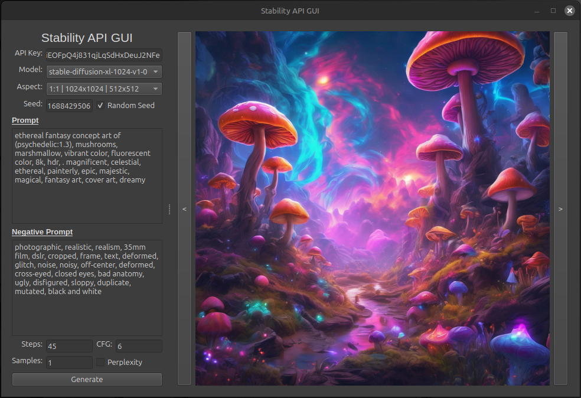

# StableAPI GUI v1.0
## Overview
StableAPI GUI was created using Python to make it easier for a user to create images using Stable Diffusion API. It currently comes with the following basic characteristics:
- Model (Does not support Stable Image Core/Ultra)
- Aspect Ratios
- Seed (Also Seed Randomizer)
- Prompt
- Negative Prompt
- Steps
- CFG Scale
- Samples
- Re-writing the Prompt Using Perplexity API
## Example of GUI

## Future Work
Currently, Stability API has many different Tools and Models I'd like to explore.

Below is a list of items I will be looking to explore and add:
- Moving picture to be saved in other, more convenient locations.
- Adding OpenAI API for Prompt Adjustments.
- Upscaling & Editing Generated images.
- General Fixes to Old UI.

Models I will be adding in the Future:
- ~~Adding Stable Diffusion 3.5 Large/Medium + Turbo~~ (Added 25/03/07)
- Upscaling
- Control
- Stable Video & 3D
- Potentially Editing (Erasing Object, Inpainting, Background Removal, etc.)
